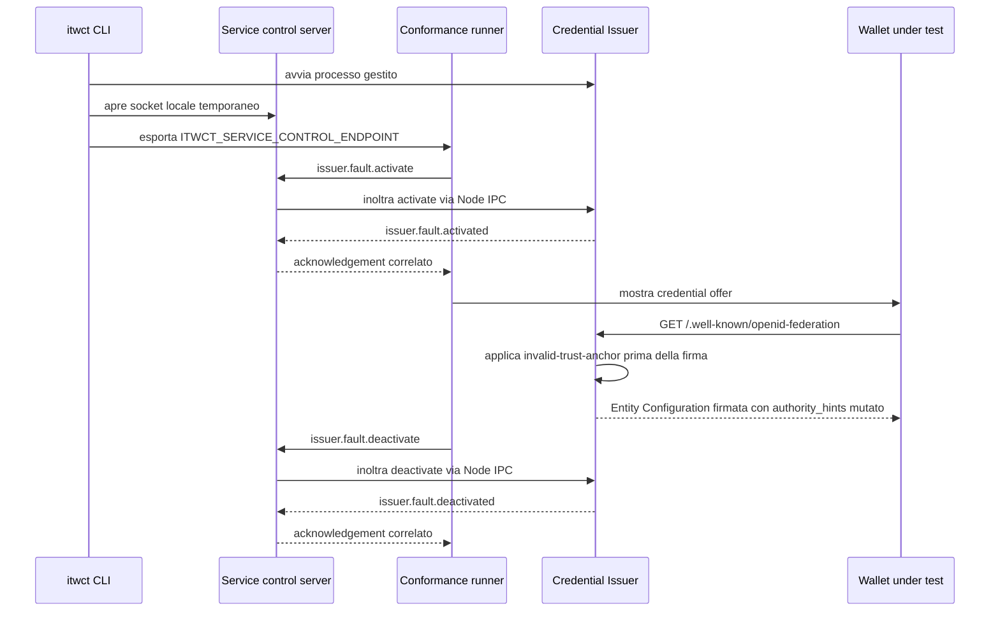

# Lifecycle dei profili di fault dell'Issuer

Questo documento descrive il meccanismo introdotto per attivare, applicare e infine disattivare un
profilo di fault sul Credential Issuer durante uno scenario di conformita.

Al fine di descrivere il flusso si prende come esempio il profilo `invalid-trust-anchor`.
Il suo scopo è servire una Entity Configuration firmata correttamente, ma con
`authority_hints` che non punta al Trust Anchor configurato. In questo modo lo scenario verifica il
comportamento del wallet sulla validazione della trust chain.

Lo stesso ciclo di vita viene usato anche dai fault applicati all'Authorization Response, come
`authorization-response-missing-claim` e `authorization-response-invalid-state`, che vengono attivati
dal runner prima dello stimolo e applicati dalla route `/code/jwt` prima della firma della response.

## Componenti coinvolti

- `packages/faults`: definisce il tipo runtime-validato `IssuerFaultProfile`, il catalogo dei profili,
  le versioni IT Wallet supportate e la regola che impedisce di attivare profili non implementati.
- `packages/conformance`: permette a uno scenario di dichiarare `setup.issuerFault`, attiva il profilo
  prima di mostrare lo stimolo al tester e lo disattiva in cleanup.
- `packages/ipc`: definisce i messaggi `issuer.fault.activate`, `issuer.fault.activated`,
  `issuer.fault.deactivate` e `issuer.fault.deactivated`, piu il client usato dal runner.
- `apps/cli`: avvia i servizi locali, apre un canale di controllo locale e inoltra i comandi dal runner
  al processo figlio che li possiede, in questo caso `credential-issuer`.
- `apps/itw-credential-issuer`: mantiene lo stato del profilo attivo in memoria e applica la mutazione
  al punto giusto della risposta.

## Sequenza end-to-end



## 1. Lo scenario dichiara il profilo

Uno scenario che necessita di una risposta anomala del Credential Issuer dichiara il profilo in
`setup.issuerFault`.

Nel caso di `WP_046a`:

```json
{
  "setup": {
    "issuerFault": {
      "type": "invalid-trust-anchor"
    }
  }
}
```

Questa dichiarazione e tipata con `IssuerFaultProfile`, importato dal package condiviso
`@itw-conformance-tool/faults`. Il runner non interpreta stringhe libere: usa lo stesso tipo che viene
validato anche dal protocollo IPC e dallo store del Credential Issuer.

## 2. Il CLI prepara il canale di controllo locale

Quando viene eseguito `itwct test issuance` oppure la matrice completa:

1. `runConformanceTests` avvia i servizi richiesti tramite `ServiceSupervisor`.
2. Dopo l'avvio dei servizi, il CLI crea un `ServiceControlServer`.
3. Il server usa un endpoint locale temporaneo:
   - Unix domain socket su POSIX;
   - named pipe su Windows.
4. L'endpoint viene passato al processo Vitest tramite `ITWCT_SERVICE_CONTROL_ENDPOINT`.

Il canale non e una route HTTP pubblica. Il relay accetta solo messaggi di controllo dei fault e della
configurazione e li inoltra al solo processo gestito che li possiede: i messaggi `issuer.*` al
`credential-issuer`, i messaggi `rp.fault.*` al `relying-party` (vedi
[`rp-fault-profile-lifecycle.md`](./rp-fault-profile-lifecycle.md)).

## 3. Il test crea il controller del runner

La suite di issuance legge `ITWCT_SERVICE_CONTROL_ENDPOINT` e costruisce un `ServiceControlClient`.
Quel client implementa direttamente l'interfaccia `IssuerFaultController`, quindi puo essere passato a
`createProtocolObservedScenarioRunner` senza adapter intermedi.

Il client:

- connette al socket locale del CLI;
- invia frame JSON delimitati da newline;
- genera un `requestId` per ogni comando;
- risolve la promise solo quando riceve l'acknowledgement correlato;
- fallisce con timeout o `service.error` se il relay o il servizio non confermano l'operazione.

## 4. Il runner attiva il profilo prima dello stimolo

Quando `runner.start(<scenarioId>)` risolve la definizione dello scenario, controlla se e presente
`definition.setup?.issuerFault`.

Se il profilo esiste:

1. verifica che sia configurato un `issuerFaultController`;
2. usa il correlation id iniziale dello scenario come `scenarioId` proprietario del fault;
3. invia `activateIssuerFault` con:
   - `scenarioId`;
   - `specVersion`, configurata dalla suite o pari al default `1.4`;
   - `profile`;
4. attende `issuer.fault.activated`.

Il credential offer viene creato e mostrato solo dopo l'acknowledgement. Questa scelta evita che il
wallet riceva una risposta nominale prima che il profilo sia effettivamente attivo.

Se l'attivazione fallisce, lo scenario non parte. Se il fault era gia stato marcato come attivo nel
runner, viene richiesta una disattivazione best-effort prima di propagare l'errore.

## 5. Il relay inoltra solo comandi ammessi

Il `ServiceControlServer` riceve il frame dal runner, lo valida con `parseIpcMessage` e accetta solo i
tipi elencati in `CONTROL_REQUEST_TARGETS`, fra cui:

- `issuer.fault.activate`;
- `issuer.fault.deactivate`.

Qualsiasi altro messaggio riceve `service.error` con `UNSUPPORTED_MESSAGE`.

Per i comandi ammessi, il relay usa `ServiceSupervisor.sendToChild(<servizio proprietario>, message)`,
che per i fault dell'issuer e `credential-issuer`.
Se il processo `credential-issuer` non e gestito o non e piu disponibile, il relay risponde con
`SERVICE_UNAVAILABLE`.

Per ogni richiesta inoltrata, il relay conserva `requestId`, socket del chiamante e timeout. Quando il
Credential Issuer risponde con `issuer.fault.activated`, `issuer.fault.deactivated` oppure
`service.error`, il relay rimanda la risposta al client giusto usando lo stesso `requestId`.

## 6. Il Credential Issuer registra il profilo attivo

All'avvio dell'app, il plugin `issuer-faults` crea uno store in memoria e lo decora sul Fastify
instance come `app.issuerFaultStore`.

Il processo `main.ts` collega lo store al protocollo IPC:

- `issuer.fault.activate` chiama `app.issuerFaultStore.activate(request)`;
- `issuer.fault.deactivate` chiama `app.issuerFaultStore.deactivate(request)`.

Lo store applica queste regole:

- esiste al massimo un fault attivo per processo;
- un fault attivo appartiene a uno `scenarioId`;
- riattivare con lo stesso `scenarioId` sovrascrive lo stato precedente;
- attivare con uno `scenarioId` diverso fallisce con `FAULT_ALREADY_ACTIVE`;
- il profilo viene validato contro il catalogo condiviso;
- i profili catalogati ma non implementati falliscono con `FAULT_NOT_IMPLEMENTED`;
- le versioni IT Wallet non supportate falliscono con `UNSUPPORTED_SPEC_VERSION`;
- lo stato salvato contiene `scenarioId`, `specVersion`, `profile`, metadati di catalogo e
  `activatedAt`.

Quando l'attivazione va a buon fine, il service adapter risponde con `issuer.fault.activated`. In caso
contrario risponde con `service.error` e il codice specifico.

## 7. Il profilo viene applicato alla Entity Configuration

La route `/.well-known/openid-federation` legge lo stato corrente con `app.issuerFaultStore.getActive()`.

Se il profilo attivo e `invalid-trust-anchor`, la route passa a `FederationService.getEntityConfiguration`
un override esplicito per `authority_hints`:

```ts
const authorityHintsOverride = ['https://wp-046a-invalid-trust-anchor.itw-conformance-tool.invalid'];
```

Il dominio `.invalid` e riservato e non puo risolvere verso un partecipante reale della federazione.
La mutazione avviene dentro la costruzione delle claims, prima di chiamare
`createItWalletEntityConfiguration`.

Restano invariati:

- header del JWT;
- chiave di firma;
- metadata;
- Trust Mark;
- tutte le altre claims.

Il risultato e una Entity Configuration con firma valida, ma semanticamente non accettabile per un
wallet che si aspetta il Trust Anchor configurato.

## 8. Viene registrata l'evidenza del fault applicato

Dopo aver generato il JWT e prima di restituirlo, la route emette un evento osservato
`issuer.fault.applied`.

La diagnostica include solo dati sicuri:

- endpoint interessato;
- tipo del profilo;
- `scenarioId` proprietario;
- versione IT Wallet risolta;
- hash SHA-256 del JWT serializzato, nel formato `sha256:<base64url>`;
- outcome `applied`.

Non vengono inseriti nel diagnostic il JWT completo, chiavi, credenziali, token o disclosure.

Per `WP_046a`, il verdetto richiede sia la richiesta della Entity Configuration sia l'evento
`issuer.fault.applied`. Inoltre verifica che, dopo quell'ingresso, il wallet non richieda il
subordinate statement del Trust Anchor configurato e non prosegua verso PAR.

Per i fault di Authorization Response, la route `/code/jwt` costruisce prima la risposta nominale,
applica al massimo una mutazione attiva e firma solo dopo la mutazione:

- `authorization-response-missing-claim` elimina il claim richiesto (`code`, `state` oppure `iss`);
- `authorization-response-invalid-state` sostituisce `state` con una stringa valida e garantita diversa
  dal valore ricevuto nel Request Object;
- il codice di autorizzazione viene comunque persistito con la scadenza nominale, cosi il test esercita
  la validazione della response da parte del wallet, non un errore server successivo.

Anche in questo caso l'evidenza viene emessa solo dopo la generazione riuscita del JWT. La diagnostica
include `omittedClaim` per i fault di omissione oppure `mutatedClaim: state` per `WP_054a`; non include
il JWT, il codice di autorizzazione, lo stato originale o lo stato mutato.

## 9. La disattivazione parte dal cleanup dello scenario

Il test chiama `session.stop()` in un blocco `finally`, cosi la disattivazione parte anche se il verdetto
o le assertion falliscono.

Anche `runner.close()` ferma tutte le sessioni ancora attive, quindi il cleanup viene eseguito anche
alla chiusura della suite.

Durante `session.stop()` il runner:

1. marca la sessione come fermata;
2. abortisce eventuali attese;
3. disconnette subscription ed event bridge;
4. chiude lo store eventi locale della sessione;
5. rimuove la sessione dall'elenco delle sessioni attive;
6. invia `deactivateIssuerFault({ scenarioId })` se il profilo era stato attivato.

La disattivazione viene eseguita alla fine del cleanup. Se fallisce, l'errore resta visibile al chiamante
invece di essere mascherato come scenario riuscito.

## 10. Lo store rilascia solo il profilo del proprietario

La deactivation segue lo stesso percorso della activation:

1. il client invia `issuer.fault.deactivate` con `requestId` e `scenarioId`;
2. il relay inoltra al child `credential-issuer`;
3. il service adapter chiama lo store;
4. lo store risponde al service adapter;
5. l'acknowledgement torna al runner.

Lo store e idempotente se non c'e nessun fault attivo: una disattivazione ripetuta dello stesso scenario
non lascia errori inutili. Se invece esiste un fault attivo di un altro `scenarioId`, lo store rifiuta la
richiesta con `FAULT_OWNERSHIP_MISMATCH`. Questo impedisce a uno scenario di spegnere per errore il
profilo di un altro scenario.

Quando il proprietario corretto disattiva il fault, lo stato in memoria torna a `undefined` e la route
federation ricomincia a usare `app.config.TRUST_ANCHOR_ENTITY_ID`.

Il plugin `issuer-faults` chiama anche `issuerFaultStore.clear()` in `onClose`, come ultima protezione
quando il processo applicativo viene chiuso.

## 11. Il ripristino viene verificato

La suite di `WP_046a` include un test di cleanup: dopo `session.stop()`, effettua una nuova richiesta a
`/.well-known/openid-federation`, decodifica la Entity Configuration e verifica che
`authority_hints` sia tornato al Trust Anchor configurato.

Questa verifica copre il rischio principale del meccanismo: un fault che resta attivo e contamina gli
scenari successivi, incluso l'happy path.

Per `/code/jwt` non esiste una probe HTTP stateless equivalente, perche serve un `request_uri` vivo
prodotto da PAR e Authorization Endpoint. Gli scenari `WP_054` e `WP_054a` verificano quindi il cleanup
con una probe sul canale di controllo: dopo `session.stop()`, attivare un nuovo fault per uno scenario
fittizio deve riuscire. Se il fault precedente fosse rimasto attivo, lo store rifiuterebbe la nuova
attivazione con `FAULT_ALREADY_ACTIVE`.

## Casi di errore principali

- Endpoint di controllo assente: la suite fallisce subito chiedendo di eseguire i test tramite CLI, che
  e responsabile dell'avvio del relay.
- Profilo sconosciuto o parametri non validi: il messaggio IPC non supera la validazione Zod.
- Profilo catalogato ma non implementato: lo store rifiuta l'attivazione con `FAULT_NOT_IMPLEMENTED`.
- Versione IT Wallet non supportata: lo store rifiuta l'attivazione con `UNSUPPORTED_SPEC_VERSION`.
- Credential Issuer non gestito dal supervisor: il relay risponde con `SERVICE_UNAVAILABLE`.
- Nessuna risposta dal child: il relay o il client scadono con un timeout limitato.
- Disattivazione con proprietario errato: lo store risponde con `FAULT_OWNERSHIP_MISMATCH`.

## Come aggiungere un nuovo profilo

Per aggiungere un nuovo profilo non basta estendere una stringa. Il flusso previsto e:

1. aggiungere lo schema del profilo in `packages/faults/src/issuer-fault-profile.ts`;
2. aggiungere l'entry nel catalogo in `packages/faults/src/issuer-fault-catalog.ts`;
3. lasciare `implemented: false` finche la mutazione non esiste davvero;
4. implementare la mutazione nel punto di risposta indicato da `applicationPoint`;
5. emettere un evento di evidenza sicuro quando la mutazione viene applicata;
6. dichiarare il profilo nello scenario con `setup.issuerFault`;
7. aggiungere test che dimostrino activation, applicazione, deactivation e ripristino nominale.

Questa sequenza mantiene allineati runner, IPC, CLI e Credential Issuer, riducendo il rischio che uno
scenario risulti "attivato" mentre il servizio non sa ancora applicare davvero il profilo.
