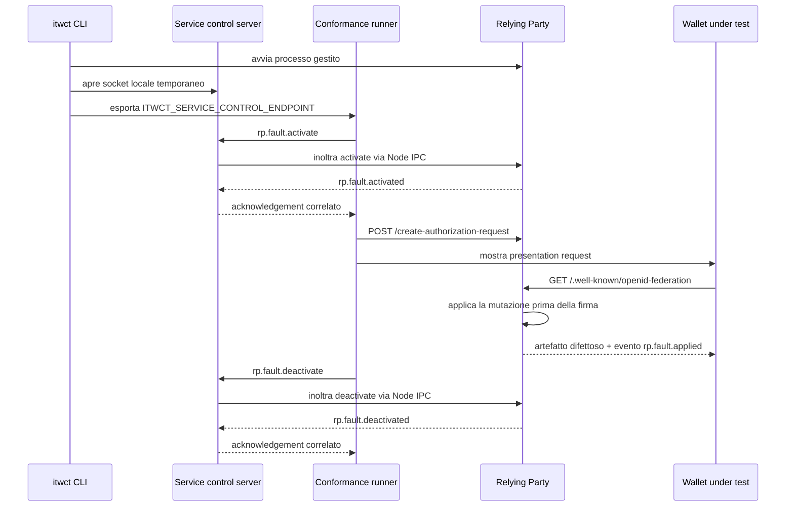

# Lifecycle dei profili di fault del Relying Party

Questo documento descrive il meccanismo che attiva, applica e infine disattiva un profilo di fault sul
Relying Party durante uno scenario di conformita della fase di presentazione.

Il ciclo di vita è volutamente identico a quello del Credential Issuer descritto in
[`issuer-fault-profile-lifecycle.md`](./issuer-fault-profile-lifecycle.md): scenario che dichiara il
profilo, attivazione dal runner prima dello stimolo, mutazione applicata nel punto di risposta,
evidenza osservata, disattivazione in cleanup. Qui vengono descritte le sole parti specifiche del
Relying Party.

## Perche servono i fault lato Relying Party

I test della fase di presentazione (WP_076 - WP_094a del
[test plan](https://italia.github.io/eid-wallet-it-docs/versione-corrente/en/test-plans-wallet-provider.html))
descrivono controlli che la Wallet Instance deve eseguire sui dati che riceve dal Relying Party:
validazione della Trust Chain, dei Trust Mark, del `request_uri`, della firma e della coerenza del
Request Object, del `response_uri` e del `redirect_uri`.

In un Happy Path nessuno di questi controlli e osservabile: il wallet completa il flusso sia che li
esegua sia che non li esegua. L'unico modo per distinguere i due casi e servire un artefatto difettoso
e osservare che il wallet **non** prosegua. Ogni scenario negativo dichiara quindi:

- il profilo di fault che rende difettoso un singolo artefatto;
- l'evidenza richiesta, che prova che il wallet ha ricevuto proprio quell'artefatto;
- la continuazione vietata, cioe il passo di protocollo che un wallet conforme non deve compiere.

## Componenti coinvolti

- `packages/faults`: definisce il tipo runtime-validato `RpFaultProfile`, il catalogo dei profili
  (`rpFaultCatalog`) e la regola di attivazione condivisa (`validateRpFaultActivation`).
- `packages/conformance`: permette a uno scenario di dichiarare `setup.rpFault`, attiva il profilo
  prima di creare la presentation request e lo disattiva in cleanup (`RpFaultController`).
- `packages/ipc`: definisce i messaggi `rp.fault.activate`, `rp.fault.activated`,
  `rp.fault.deactivate` e `rp.fault.deactivated`, piu i relativi handler nel service adapter.
- `apps/cli`: il relay locale instrada ogni messaggio di controllo al processo figlio che lo possiede
  (`CONTROL_REQUEST_TARGETS`): i messaggi `issuer.*` al `credential-issuer`, i messaggi `rp.fault.*`
  al `relying-party`.
- `apps/itw-relying-party`: mantiene in memoria lo stato del profilo attivo (`rpFaultStore`) e applica
  la mutazione al punto giusto della risposta.

## Catalogo dei profili

Il Relying Party locale e fissato alla versione IT Wallet `1.3` (vedi `src/plugins/sdk.ts`), quindi
tutti i profili dichiarano `supportedSpecVersions: ['1.3']`.

| Profilo                            | Punto di applicazione | Effetto                                                                                                                                 | Test Matrix |
| ---------------------------------- | --------------------- | --------------------------------------------------------------------------------------------------------------------------------------- | ----------- |
| `invalid-trust-anchor`             | Entity Configuration  | `authority_hints` sostituito con un Entity ID `.invalid` che non risolve                                                                | WP_079      |
| `invalid-trust-mark`               | Entity Configuration  | Trust Mark nominale ma firmato con una chiave effimera non pubblicata                                                                   | WP_080      |
| `unattested-request-uri`           | Entity Configuration  | `request_uris` non contiene il `request_uri` consegnato nell'engagement                                                                 | WP_081      |
| `missing-presentation-trust-mark`  | Entity Configuration  | nessun Trust Mark: la federazione non autorizza le presentazioni                                                                        | WP_087      |
| `unattested-response-uri`          | Entity Configuration  | `response_uris` non contiene il `response_uri` del Request Object                                                                       | WP_091a     |
| `request-object-invalid-signature` | Request Object        | header nominale, firma prodotta con una chiave effimera                                                                                 | WP_085      |
| `request-object-invalid-client-id` | Request Object        | `iss` diverso dal `client_id` dell'engagement e dal `sub` della Entity Configuration                                                    | WP_086      |
| `request-object-federation-key`    | Request Object        | header senza `x5c` e `client_id` con prefisso `openid_federation`: la chiave di firma resta pubblicata solo nei metadata di federazione | WP_084      |
| `request-object-missing-parameter` | Request Object        | omette un parametro REQUIRED (`nonce` oppure `response_type`)                                                                           | WP_090      |
| `unattested-redirect-uri`          | Entity Configuration  | `redirect_uris` non contiene il `redirect_uri` restituito dall'Authorization Response                                                   | WP_094a     |

Non tutti i profili producono un artefatto difettoso. `request-object-federation-key` (WP_084) serve
un Request Object perfettamente valido: rimuove solo le fonti alternative della chiave di verifica
(`x5c` e un eventuale `trust_chain` inline) e sposta il `client_id` sul prefisso `openid_federation`,
cosi che l'unico modo per verificare la firma sia risolvere la Entity Configuration del Relying Party
e cercare il `kid` in `metadata.openid_credential_verifier.jwks`. Lo scenario corrispondente e quindi
un Happy Path: un wallet conforme completa la presentazione, e proprio il completamento prova che la
chiave e stata presa dai metadata di federazione.

> **Attenzione (versione delle specifiche).** Lo schema dell'header JAR della SDK richiede `x5c` per
> IT Wallet `1.3` e `trust_chain` per `1.0`: un header con solo `alg`/`kid`/`typ` non e valido per
> nessuna delle due. Un wallet che valida l'header secondo lo schema `1.3` rifiuta quindi il Request
> Object prima ancora di risolvere la chiave, e lo scenario risulta inconclusivo invece di provare
> WP_084. Il profilo implementa quanto richiede la Test Matrix (la chiave presente solo nei metadata
> di federazione), ma resta da decidere come conciliarlo con il vincolo `1.3`.

Tre principi guidano queste mutazioni:

1. **Un solo difetto per profilo.** Gli altri artefatti restano nominali, cosi il verdetto attribuisce
   il rifiuto del wallet al controllo che lo scenario vuole verificare.
2. **La firma resta valida quando non e lei l'oggetto del test.** Le Entity Configuration mutate e i
   Request Object con `iss` o parametri alterati restano verificabili: il wallet deve arrivare al
   controllo semantico, non fermarsi prima sulla crittografia.
3. **Gli endpoint restano raggiungibili.** I profili `unattested-*` cambiano solo la lista attestata
   nei metadata, mentre l'endpoint reale continua a rispondere ed e strumentato. Un wallet che salta il
   controllo viene quindi osservato mentre lo usa, invece di fallire per un endpoint irraggiungibile.
   I path pubblicati al posto di quelli reali (`/auth/request-unattested`, `/auth/response-unattested`,
   `/callback-unattested`) non corrispondono ad alcuna route: nessuno richiede mai un URI attestato, il
   wallet lo usa solo come termine di confronto.

   Ne consegue che per questi tre profili l'evidenza della continuazione vietata e la stessa che
   nell'Happy Path prova la conformita, sullo stesso endpoint reale: e lo scenario, non la route, a
   dichiarare se quel passo sia richiesto o vietato.

## Attivazione

L'attivazione precede la creazione della presentation request: il runner attende
`rp.fault.activated` prima di chiamare `/create-authorization-request`, cosi il wallet non puo mai
ricevere un artefatto nominale per quella sessione.

Lo store applica le stesse regole di quello dell'Issuer: un solo fault attivo per processo, proprieta
legata allo `scenarioId`, riattivazione idempotente per lo stesso proprietario,
`FAULT_ALREADY_ACTIVE` per un proprietario diverso, `FAULT_OWNERSHIP_MISMATCH` su disattivazione da
parte di un non proprietario, validazione contro il catalogo condiviso e rifiuto delle versioni non
supportate.

## Evidenza `rp.fault.applied`

Ogni mutazione riuscita emette un evento osservato `rp.fault.applied` (vedi
`src/faults/rp-fault-evidence.ts`) con diagnostica volutamente ristretta a dati sicuri:

- `endpoint` interessato;
- `faultProfileType`;
- `scenarioId` proprietario;
- `resolvedSpecVersion`;
- `artifactHash`, nel formato `sha256:<base64url>`;
- `outcome: 'applied'`;
- eventualmente il dettaglio della mutazione (`mutatedClaim`, `omittedParameter`,
  `mutatedArtifactPart`).

Non vengono mai inseriti l'artefatto completo, chiavi, credenziali o token. L'evento viene emesso solo
dopo che l'artefatto mutato e stato costruito: un errore in fase di emissione propaga invece di
registrare un fault "applicato" che non e mai stato servito.

Il meccanismo del `correlationId` di protocollo e attualmente disattivato, quindi l'evento e emesso
non correlato e viene adottato dallo scenario come evidenza post-start ristretta dalle sue
diagnostiche (`match`).

## Continuazioni vietate

Gli scenari negativi dichiarano `forbiddenEvents` con la stessa forma delle evidenze richieste, quindi
possono vietare una continuazione ristretta (per esempio una richiesta su un endpoint specifico)
invece di ogni occorrenza di un nome di evento. Il bridge SQLite adotta anche gli eventi vietati
dichiarati: un evento che non viene adottato non arriva allo store dello scenario e non potrebbe ne'
far scattare `expectNone`, ne' essere riportato dal verdict engine.

Per gli scenari in cui il wallet deve fermarsi, la finestra di osservazione negativa
(`forbiddenObservationMs`, 30 secondi) e la parte che decide il verdetto: se entro quella finestra la
continuazione vietata non arriva, il wallet ha superato il controllo.

## Disattivazione e ripristino

`session.stop()` viene invocato in un blocco `finally` dal test, quindi la disattivazione parte anche
se il verdetto o le assertion falliscono; `runner.close()` ferma comunque le sessioni ancora attive
alla chiusura della suite. Il plugin `rp-faults` chiama `rpFaultStore.clear()` in `onClose` come
ultima protezione.

La suite di presentazione verifica il ripristino in due modi complementari:

1. una probe HTTP su `/.well-known/openid-federation`, che deve tornare a pubblicare il Trust Anchor
   configurato, il Trust Mark e le liste `request_uris`/`response_uris` nominali;
2. una probe sul canale di controllo, che attiva e disattiva un profilo per uno `scenarioId` fittizio:
   se un fault fosse rimasto attivo, lo store rifiuterebbe l'attivazione con `FAULT_ALREADY_ACTIVE`.

## Come aggiungere un nuovo profilo

1. aggiungere lo schema del profilo in `packages/faults/src/rp-fault-profile.ts`;
2. aggiungere l'entry nel catalogo in `packages/faults/src/rp-fault-catalog.ts`;
3. lasciare `implemented: false` finche la mutazione non esiste davvero;
4. implementare la mutazione nel punto di risposta indicato da `applicationPoint`;
5. emettere `rp.fault.applied` con diagnostica sicura quando la mutazione viene applicata;
6. dichiarare il profilo nello scenario con `setup.rpFault`, insieme all'evidenza richiesta e alla
   continuazione vietata;
7. aggiungere il test che dimostri activation, applicazione, deactivation e ripristino nominale.
