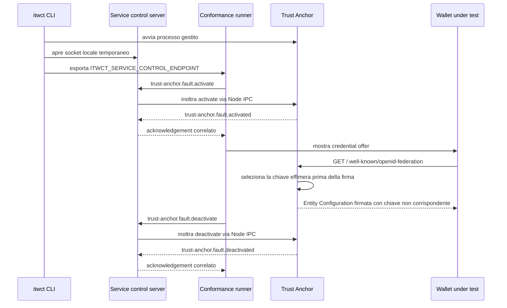

# Lifecycle dei profili di fault del Trust Anchor

Questo documento descrive il ciclo di vita dei fault applicati al servizio `itw-trust-anchor` durante uno
scenario interattivo di conformita. Il primo profilo implementato e
`entity-configuration-nonmatching-signing-key`, usato da `WP_017`.

## Obiettivo

Il profilo serve `/.well-known/openid-federation` con una Entity Configuration auto-consistente ma firmata
con una chiave ES256 effimera diversa dalla chiave nominale generata da `itwct init` in
`<data_dir>/trust-anchor/federation-key.jwk.json`.

La risposta anomala:

- pubblica in `jwks.keys` solo la chiave pubblica effimera;
- usa lo stesso `kid` effimero nell'header JWS;
- firma il JWT con la corrispondente chiave privata effimera;
- conserva claims, metadata, endpoint e durata nominali.

In questo modo il wallet puo verificare la firma rispetto alla chiave pubblicata nel JWT, ma deve
scartare la Entity Configuration perche quella chiave non corrisponde alla chiave del Trust Anchor
distribuita out-of-band.

## Componenti coinvolti

- `packages/faults`: definisce `TrustAnchorFaultProfile`, il catalogo dedicato e la validazione per
  versione IT Wallet.
- `packages/ipc`: definisce i messaggi `trust-anchor.fault.activate`, `trust-anchor.fault.activated`,
  `trust-anchor.fault.deactivate` e `trust-anchor.fault.deactivated`.
- `apps/cli`: instrada i comandi Trust Anchor verso il processo gestito `trust-anchor` e correla le
  risposte al servizio atteso.
- `apps/itw-trust-anchor`: mantiene lo stato del profilo attivo in memoria, genera la chiave effimera una
  sola volta per processo e applica il fault solo alla Entity Configuration del Trust Anchor.
- `packages/conformance`: permette a uno scenario di dichiarare `setup.trustAnchorFault`, attiva il fault
  prima dello stimolo e lo disattiva in cleanup.

## Sequenza end-to-end

## Ownership e cleanup

Lo store del Trust Anchor e single-active e ownership-aware:

- un solo fault puo essere attivo nel processo;
- lo scenario proprietario e identificato dal correlation ID iniziale;
- una riattivazione con lo stesso `scenarioId` sovrascrive lo stato;
- un altro `scenarioId` non puo attivare o disattivare il fault proprietario;
- la disattivazione senza fault attivo e idempotente;
- `onClose` cancella lo stato in memoria.

Il runner attiva il profilo prima di creare o mostrare lo stimolo e lo disattiva da `session.stop()`.
La disattivazione viene tentata anche nei rami di errore prima che la sessione sia restituita al test.

## Isolamento della chiave effimera

La chiave effimera e generata in memoria dal plugin `trust-anchor-faults` una sola volta per processo, con
`kid` `wp-017-nonmatching-trust-anchor-key`. Prima di esporre il plugin, il thumbprint pubblico della
chiave effimera viene confrontato con quello della chiave nominale; una collisione causa fail-fast.

La chiave effimera:

- non viene scritta nel `data_dir`;
- non sostituisce `federation-key.jwk.json`;
- non genera certificati;
- non viene usata da `/fetch`;
- non viene inserita in log o diagnostica.

## Evidenze

La route del Trust Anchor emette:

- `trust_anchor.entity_configuration.requested` per la richiesta a `/.well-known/openid-federation`;
- `trust_anchor.fault.applied` solo quando il profilo viene applicato.

La diagnostica del fault contiene solo dati allow-listed:

- `endpoint`;
- `faultProfileType`;
- `scenarioId`;
- `specVersion`;
- `artifactHash` nel formato `sha256:<base64url>`;
- `outcome: 'applied'`.

Non contiene JWT completo, JWK, coordinate EC, chiavi private, token o materiale out-of-band.

## Limite sui log del wallet

`WP_017` richiede anche che il wallet registri la discrepanza secondo la propria policy. L'harness attuale
osserva solo richieste, risposte ed eventi dei servizi locali: non riceve log autenticati e normalizzati dal
Wallet Instance. Per questo il verdetto automatico dimostra il comportamento di rete, ma non dichiara
verificato il sotto-requisito di logging interno del wallet.
